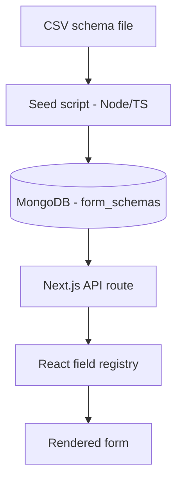

# Schema-Driven Insurance Quote Form

A small full-stack project demonstrating a **schema-driven (metadata-driven) form rendering** pattern — common in insurance and fintech SaaS platforms — where field definitions live in structured data, not in frontend code. Adding a new product's form means editing a spreadsheet, not writing new UI.

## How it works



1. **CSV schema** — one row per field: label, input type, options, required, order, section.
2. **Seed script** (`seed/seed.ts`) — parses the CSV, validates it, and upserts one MongoDB document per product. Re-running it after editing the CSV is always safe.
3. **MongoDB** — stores each product's schema as nested `sections -> fields` documents.
4. **API route** (`web/app/api/forms/[id]/route.ts`) — serves a product's schema as JSON.
5. **Frontend** (`web/components/DynamicForm.tsx`) — a field-type registry maps each `input_type` string to a React component and renders the form dynamically. There's no hardcoded form markup and no `if/else` chain — adding a new input type later is a one-line addition to the registry.

## Tech stack

- MongoDB Atlas
- Node.js / TypeScript (seed script)
- Next.js (App Router) + React + TypeScript
- CSV as the schema authoring format

## Project structure

```
BrokerLift_Project/
├── seed/                  # One-off script: CSV -> MongoDB
│   ├── data/
│   │   └── auto_insurance_schema.csv
│   ├── seed.ts
│   └── package.json
└── web/                   # Next.js app
    ├── app/
    │   ├── api/forms/[id]/route.ts
    │   └── products/[id]/page.tsx
    ├── components/
    │   ├── DynamicForm.tsx
    │   └── DynamicForm.module.css
    ├── lib/
    │   └── mongodb.ts
    └── package.json
```

## CSV schema format

| Column | Description |
|---|---|
| `product_id` | Which product this field belongs to |
| `section` | Groups fields into blocks on the rendered form |
| `field_name` | Unique key, snake_case |
| `label` | Text shown to the user |
| `input_type` | `text`, `email`, `tel`, `number`, `date`, `select`, `radio`, `checkbox`, `textarea` |
| `options` | Pipe-separated choices (`select` / `radio` only) |
| `required` | `true` / `false` |
| `order` | Render order within its section |
| `placeholder` | Optional hint text |
| `default_value` | Optional pre-filled value |

## Running it locally

### 1. Seed the database

```bash
cd seed
npm install
# create .env with:
#   MONGODB_URI=<your Atlas connection string>
#   DB_NAME=brokerlift_clone
node seed.ts
```

### 2. Run the app

```bash
cd web
npm install
# create .env.local with the same MONGODB_URI and DB_NAME
npm run dev
```

Visit `http://localhost:3000/products/auto_insurance`.

## Key design decisions

- **Idempotent seeding** — the seed script upserts on `product_id`, so it can be re-run freely as the CSV changes without creating duplicates.
- **Validation before write** — a `select`/`radio` field with no `options` throws immediately with the offending row number, instead of silently seeding data the frontend can't render.
- **Field-type registry over conditionals** — `DynamicForm.tsx` looks up `fieldRegistry[field.input_type]` rather than branching on type. This is the core of what makes the UI schema-driven.
- **Connection caching in dev** — `lib/mongodb.ts` caches the MongoDB client across Next.js hot reloads, avoiding a common gotcha where every code change silently opens a new connection to Atlas.

## Possible next steps

- Conditional field visibility (a `show_if` column)
- Persisting submitted quotes back to MongoDB
- Multiple insurance products seeded from the same CSV
- A lightweight admin UI for editing schemas without touching the CSV directly
